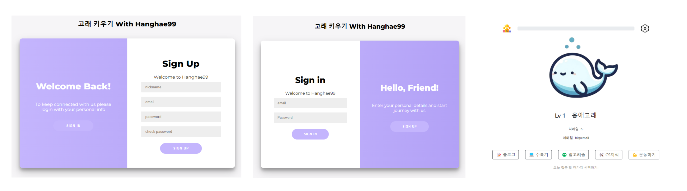
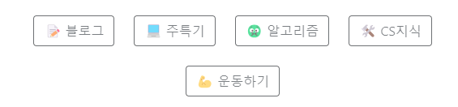
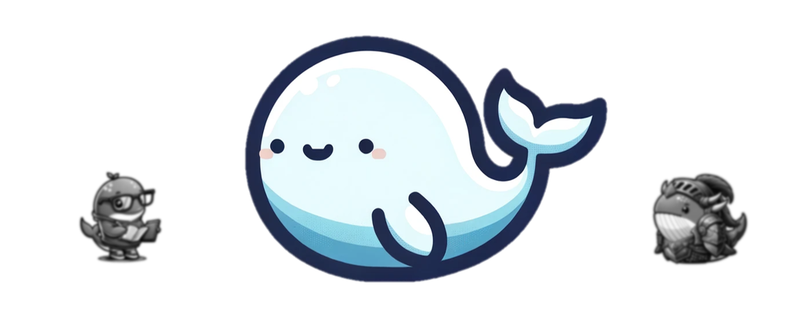

## v1.0.0

  

<h1 align="center">🐳 고래 키우기</h1>
<h4>항해99 18기 5조 미니프로젝트</h4>
매일매일 고래에게 ‘공부’ 먹이를 주고, 항해 99일간 키우면 성장 완료!

## 💻 preview
고래 키우기를 소개할게요! 
[Growup-whale](https://naraspc.notion.site/1b29f2fbcbe74a299b0876e35064b7b1)

[고래키우기 시연 영상](https://youtu.be/D-ZuqNl9Zzk) 

## 👨‍👨‍👧‍👦 팀원
- [김기민](https://github.com/js1171) - 회원가입
- [김진욱](https://github.com/naraspc) - JWT, 로그인 구현, 보안
- [이지선](https://github.com/js1171) - 메인로직
- [이창우](https://github.com/woo3145) - 프로젝트 총괄 관리, 메인페이지

## 기능

실제 비밀번호를 사용해도 괜찮을까?

<aside>
❓ 미니 프로젝트에 제 실제 비밀번호를 사용해도 괜찮을까요?

</aside>

**⇒ 안심하고 사용해도 괜찮습니다!**

- SQLAlchemy라는 ORM을 사용해 DB와 통신함으로써 SQL Injection에 대해 대비
- 암호화 알고리즘을 적용해 PW DB에 저장
    - DB에 저장되는 PW는 암호화된 값이므로, **PW찾기 기능은 지원하지않습니다.**
- 블라인드 SQL 인젝션, 유니온 베이스 인젝션, 에러 베이스 인젝션 테스트 완료
- 어드민 권한 탈취를 방지하기 위해 프로젝트 기능상 필요없는 권한은 구현하지 않았습니다.

## 트러블슈팅

### JWT

<aside>
🚫 flask_jwt_extended의 get_jwt_identity 기능을 사용하여 토큰 검증
⇒ SSR방식 렌더링으로 인해 응답 전 토큰을 헤더에 실지 못하는 경우 발생

</aside>

- decode_token 메서드로 직접 쿠키를 파싱하여, 유효하면 jwt에 담긴 내용을 반환해주는 메서드를 정의하여 사용
    
 

### 진화 루트 구하기

<aside>
🚫 고래의 레벨을 구하고 Level UP과 진화 루트 구하는 함수가 복잡함

</aside>

- Level별 진화 경험치 정보를 json 파일로 분리
- 고래 데이터 json 파일의 구조를 변경하여 루트 선택의 복잡함 감소
  

  

고래의 밥!

- 고래에게 줄 밥을 하나 클릭!
- 밥은 하루에 한 번만 줄 수 있음

고래 진화!

 **Level 1 : 응애 고래**
    
- 회원 가입 후 나오는 첫 번째 고래
- 먹이를 주면 성장!

진화

- 99일의 최종 Level은 Lv5
- 먹이 종류에 따라 성장 형태 변화
- 진화하는 과정은 비밀~

 

로그인 / 회원가입

- JWT토큰을 사용한 인증처리

## 🛠️ Stack

### Backend
- 언어: `Python`
- 프레임워크: `Flask`
- DB: `SQL3LITE`
- ORM: `SQLALCHEMY`
- 인증: `JWT`
- 배포: `AWS-S3`, `PythonAnyWhere`

### Front
- 언어: `JavaScript`, `HTML`
- CSS: `Bootstrap`
- 템플릿 엔진: `Jinja2`
